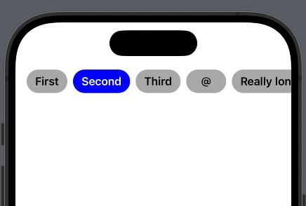

# ScrollSegmentsSwift

     

## Example

Look at ScrollSegmentsSwiftUI -> Preview

## Swift Package Manager

(right click at the project files structure) > Add Package Dependencies > Add https://github.com/syngenta/ScrollSegmentsSwift.git

## Author

raketenok@gmail.com, raketenok@gmail.com, 

## License

ScrollSegmentsSwift is available under the MIT license. See the LICENSE file for more info.
